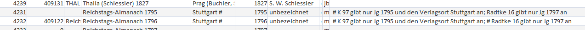

# Musenalmanache: Allgemeines und Vorgehen
## Zum Gegenstand: Musenalmanache
Die Sammlung von Musenalmanachen erfasst derzeit etwa 4500 Bände von meist jährlich erscheinenden Periodika mit Kalendarium, Text-, Noten- und/oder Bildbeiträgen aus dem 18. und 19. Jahrhundert. Dabei erfassen die Daten nicht nur Almanache, die den Bestand der Sammlung der TSS ausmachen, sondern versteht sich vor allem als *Bibliografie* überhaupt existierender Almanache. Die wichtigsten Zeugen für die Bibliografie sind unter anderen (s.a. [alte Musenalm-Seite](https://old.musenalm.de/gesamtanleitung.html)):

> Goedeke, Carl u. a.: Grundriß zur Geschichte der deutschen Dichtung. 13 Bde., 2. Aufl., Dresden 1884 ff. (Bd. IV/1-4 in der dritten neubearbeiteten Aufl., Dresden 1896-1913. Neudruck Berlin 1955; Bd. IV/5 in der ersten Aufl. Düsseldorf 1957-1960; außerdem die "Neue Folge", N. F. Bd. I, Berlin 1955ff.)

> Köhring, Hans (Bearb. Hrsg.): Bibliographie der Almanache, Kalender und Taschenbücher für die Zeit von ca. 1750-1860. Hamburg 1929. Neudruck Bad Karlshafen 1987.

> Lanckoronska, Maria; Rümann, Arthur: Geschichte der deutschen Taschenbücher und Almanache aus der klassisch-romantischen Zeit. München 1957. Neudruck Osnabrück 1985.

Die Erfassung von Almanachen impliziert drei Ebenen einer quasi-hierarchischen Gliederung:

`Reihen`
:   Reihen sind Zusammenfassungen von jährlich erscheinenden Almanachen, meist werden Reihentitel aus den Titelangaben einzelner Bände abstrahiert. Manche Reihen sind offensichtlich Übersetzungen französischer Titel. In der Access-DB sind Reihen bisher nicht gesondert, sondern im Feld `REIHENTITEL` in der Tabelle --> [`AlmNeu`](1_Musenalmanache/2_AlmNeu.md) dokumentiert.

`Bände`
:   Einzelne Ausgaben, konkrete Manifestationen von Almanachen. Nicht nur gesichtete, sondern auch nur bezeugte Ausgaben. In der Tabelle --> [`AlmNeu`](1_Musenalmanache/2_AlmNeu.md) sind Bände als Einträge erfasst.

`Inhalte`
:   Einzelne Beiträge eines Bandes, wie Kalendarium, Gedicht, Titel, Stich u.s.w. In der Tabelle -->&nbsp;[`INH-TAB`](1_Musenalmanache/3_INH-Tab.md) als Einträge erfasst.

## Bilder
Die Bilder sind als JPG und mit Wasserzeichen bzw. Erkennungsnummern versehen im Ordner `alma/Scans/` gespeichert. Die Benennung der Unterordner folgt der Angabe in Tabelle/Feld `AlmNeu/NUMMER`, die der Dateien der Angabe in Tabelle/Feld `INH-Tab/OBJZAEHL`. Der Ordner ist etwa 7.25 GB groß.

## Reihen-Datei
Zusätzlich zur Access-Tabelle s.u. gibt es noch eine Excel-Liste und Ausdrucke aller Reihentitel.

## Access-Datei
Die Daten werden in einer Access-Datei gehalten und eingetragen (Pfad: `alma/Datenbank/Datenbank_Aktuelle_Bearbeitung.mdb`). Zusätzlich zu den beiden oben genannten Tabellen ist die Tabelle --> [`REALNAME-Tab`](1_Musenalmanache/4_REALNAMEN-Tab.md) relevant, die Normdaten für Personennamen enthält. 

## Abkürzungen
Vor allem die Felder `NACHWEIS` und `STRUKTUR` der Tabellen `GM-BIBLIO` und `AlmNeu` profitieren von der extensiven Nutzung von Abkürzungen.

`ar, ar1, ar2`
:   arabische Paginierung (ggf mehrere)

`B; BB`
:  Blatt; Blätter

`C`
:   Corrigenda

`Diagr`
:   Diagramm

`G; GG`
:   Graphik; Graphiken

`UG r, v`
:   Umschlaggraphik recto, verso

`TG r, v`
:   Titelgraphik, Titelportrait etc

`gA`
:   graphische Anleitung

`gTzA`
:   graphische Tanzanleitung

`G-Verz`
:   Verzeichnis der Kupfer u. ä.

`Hrsg`
:   Herausgeber

`I-Verz`
:   Inhaltsverzeichnis

`Kal`
:   Kalendarium

`Kr`
:   Karte

`MusB; MusBB`
:   Musikbeigabe; Musikbeigaben

`röm, röm1, röm2`
:   römische Paginierung (ggf mehrere)

`S; SS`
:   Seite; Seiten

`Sp`
:   Spiegel

`T`
:   Titel

`gT`
:   graphischer Titel

`vT`
:   Vortitel

`nT`
:   Nachtitel

`zT`
:   Zwischentitel

`Tab`
:   Tabelle

`VB`
:   Vorsatzblatt

`Vf`
:   Verfasser

`VrlgM`
:   Verlagsmitteilung

`Vrwrt`
:   Vorwort

## Symbole
In der Tabelle werden einige Sonderzeichen benutzt, die für eine feste Bedeutung reserviert sind. Oftmals sind Felder mit diesen Sonderzeichen angemerkt, dann folgen im Anmerkungsfeld nach Wiederholung des Sonderzeichens entsprechende Erläuterungen. Beispiel:

Folgende Symbole sind definiert:

`§`
:   fehlt

`§§`
:   mehrere fehlen.

`$`
:   vermutlich

`#`
:   siehe Anmerkung

`/)`
:   Trennungzeichen (vor allem weil keine Zeilenumbrüche in den Feldern möglich sind.)

`+++`
:   Inhalte aus mehreren Almanachen Interpoliert